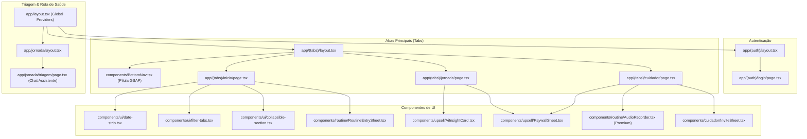
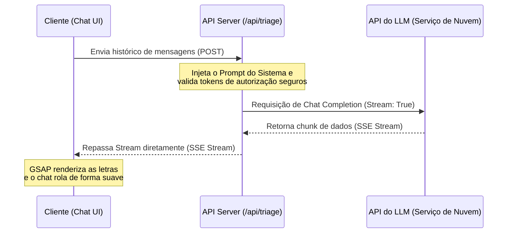
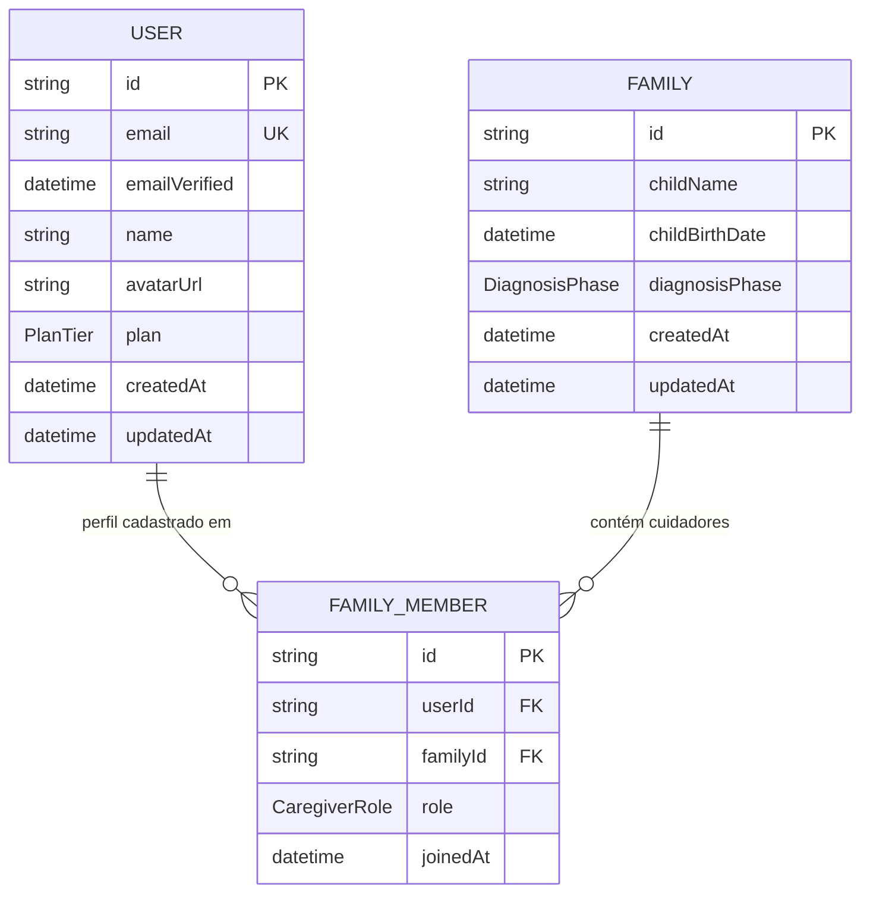
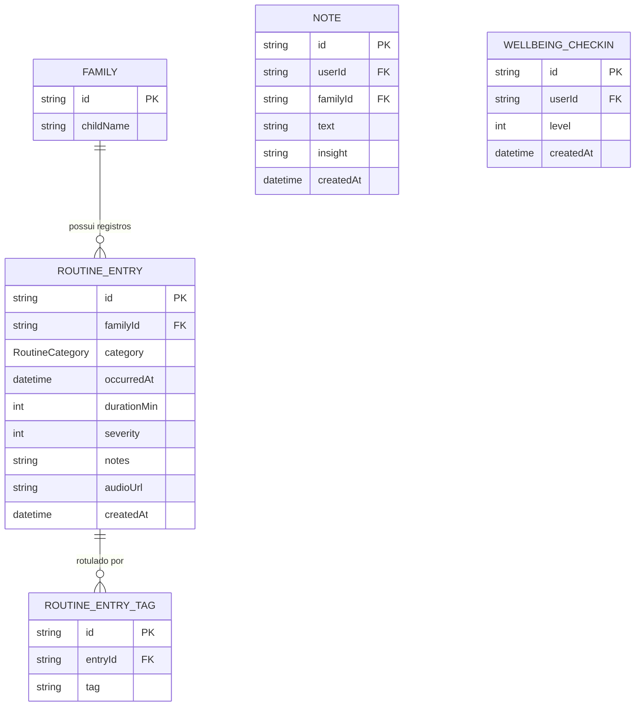
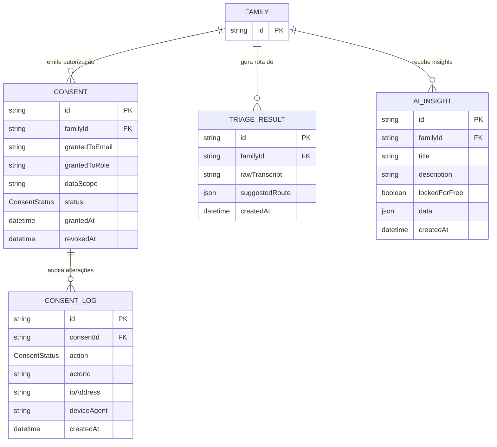
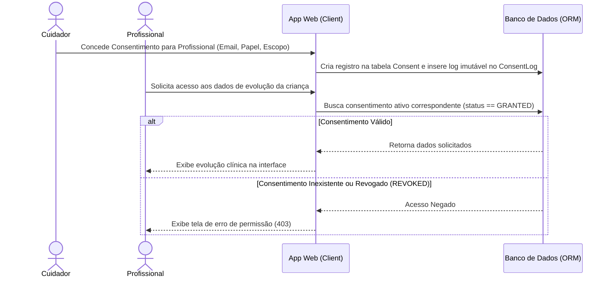
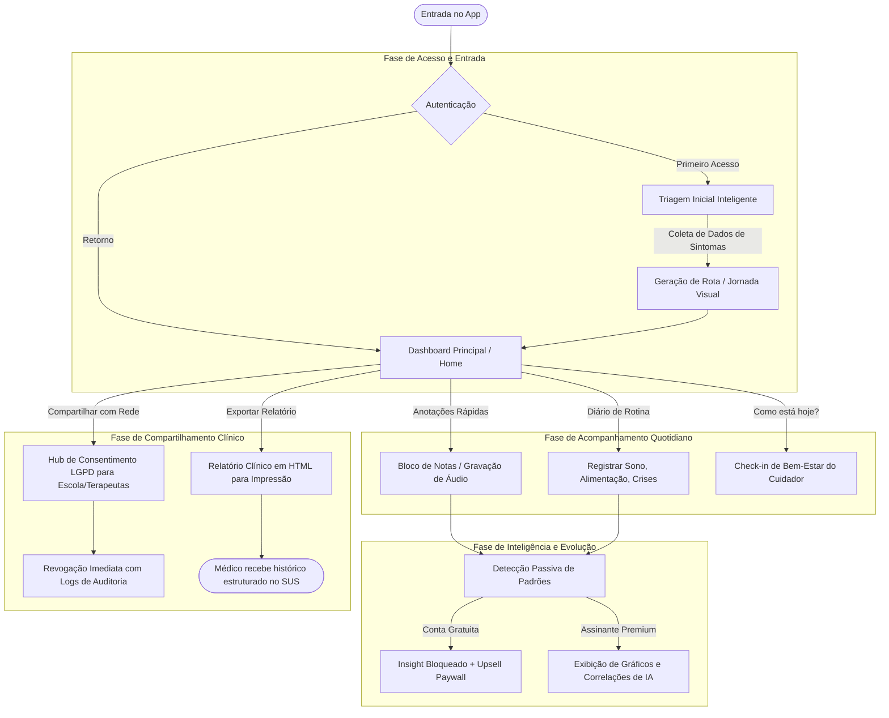

# 📐 Arquitetura & Infraestrutura do Sistema

Esta documentação descreve a infraestrutura técnica, padrões de projeto, diagramas de arquitetura e conformidade da plataforma **Neuro +**.

---

## 🏗️ Padrões de Projeto & Estrutura

O Neuro + é implementado como um monorepo TypeScript utilizando workspaces.
*   **Camada de Aplicação (`apps/web`):** Next.js 16 com App Router. Utiliza componentes do React 19 de forma híbrida:
    *   *Server Components (RSC):* Para renderização inicial rápida, SEO e busca de dados eficiente.
    *   *Client Components:* Para controle de estado local, animações GSAP (como fade-in e rolagem com ScrollTrigger) e sheets de interação (como formulário de convite e paywall).
*   **Camada de Dados (`packages/db`):** Centralizada com Prisma ORM e PostgreSQL, garantindo tipagem forte e migrações consistentes.
*   **Comunicação:** Rotas API REST e suporte a tRPC para comunicação TypeScript end-to-end livre de erros de tipagem.

---

## 📊 Diagramas de Arquitetura

### 1. Component Tree (Árvore de Componentes)

Mapeia a estrutura de páginas e componentes chave da interface do aplicativo principal `apps/web`.

---

### 2. Data Flow (Fluxo de Dados da Triagem AI)

Mostra como as mensagens de chat trafegam do cliente para as APIs de terceiros mantendo a segurança da infraestrutura de chaves de API e transmitindo as respostas em formato Event Stream (SSE).

---

### 3. DB Schema (Modelo Físico do Banco)

Para facilitar a leitura e evitar diagramas excessivamente complexos, o esquema de dados do banco de dados (`schema.prisma`) foi dividido em três modelos temáticos:

#### A. Núcleo de Usuários, Cuidadores & Família
Mapeia o cadastro de contas e agrupamento familiar.

#### B. Rotina & Evolução de Cuidado
Mapeia os registros cotidianos, anotações e sentimentos dos cuidadores.

#### C. Segurança, Consentimento LGPD & Insights de IA
Mapeia as auditorias de acesso e gerações automáticas de rota médica.

---

### 4. Auth & Consent Flow (Autenticação e LGPD)

Fluxo de validação de autenticação e controle de acesso a dados médicos auditado pela tabela de consentimento.

---

### 5. Fluxo de Interação com o App de Ponta a Ponta

Visão completa do caminho trilhado pela família dentro da plataforma Neuro +.

---

## 🔒 Proteção de Dados e LGPD

1.  **Trilha de Auditoria Imutável:** Todas as alterações de status de compartilhamento (concessões e revogações) disparam gatilhos no banco de dados que salvam registros na tabela `ConsentLog` contendo identificadores e metadados de acesso (sem chaves privadas). Esta tabela não possui métodos de alteração (`UPDATE`) ou exclusão (`DELETE`) expostos na API.
2.  **Consentimento Granular:** O escopo do dado (`dataScope`) define limites estritos de permissão de leitura. Por exemplo, a professora da escola não tem permissão para visualizar laudos médicos se o consentimento concedido abranger apenas evolução escolar.
